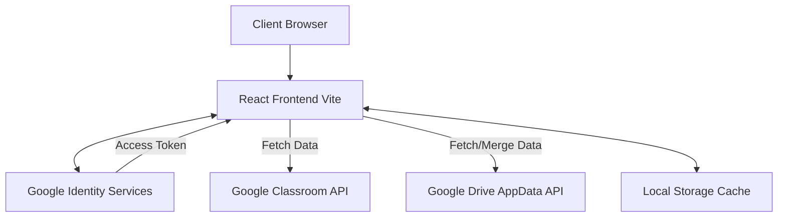

# System Architecture

CH Classroom Hub is a modern Single Page Application (SPA) built to consolidate student data from various Google services into a unified, minimalistic dashboard.

## 1. High-Level Overview



## 2. Core Components

### 2.1 Context Providers (State Management)
The application relies heavily on React Context for global state distribution, avoiding unnecessary prop-drilling.

- **`AuthContext`**: Manages the OAuth lifecycle, token refreshing, and silent sign-ins. Exposes `accessToken`, `profile`, `login`, and `logout`.
- **`ClassroomContext`**: The brain of the application. Responsible for aggregating data from Google Classroom (Courses, Coursework, Announcements) and combining it with local configurations (e.g., `hiddenCourseIds`).
- **`SettingsContext`**: Handles UI configurations, language preferences, and manages the Google Drive Synchronization loop.

### 2.2 Storage & Caching Layer
Data is heavily cached in `localStorage` to provide an "offline-first" feel and instant load times.

- **Scoped Keys**: Data is stored using the authenticated user's email as a prefix (e.g., `student@kmutnb.ac.th:schedule`).
- **Memory Caching**: A singleton `StorageRepository` class provides an in-memory Map cache to prevent excessive disk reads/writes during React re-renders.

### 2.3 Synchronization Engine
Because the app does not have a dedicated backend database, it uses Google Drive's hidden `AppData` folder as a remote state store.

- **Merge Heuristics**: When `SyncManager.js` downloads remote data, it compares the `updatedAt` timestamps of the remote payload against the local payload. The latest timestamp wins, ensuring that multi-device usage (e.g., using a laptop and a mobile phone) seamlessly converges without overwriting newer data.

## 3. Directory Structure

```text
src/
├── components/      # Reusable UI elements (Buttons, Modals, Spinners)
├── contexts/        # Global state providers
├── features/        # Feature-specific logic (exams, assignments)
├── pages/           # Route-level view components (Dashboard, Settings)
├── repositories/    # Data access layer (Storage, API wrappers)
├── services/        # Business logic (SyncManager, Notification Configs)
├── utils/           # Helper functions (httpClient, logger, date formatting)
└── main.jsx         # Application entry point
```
